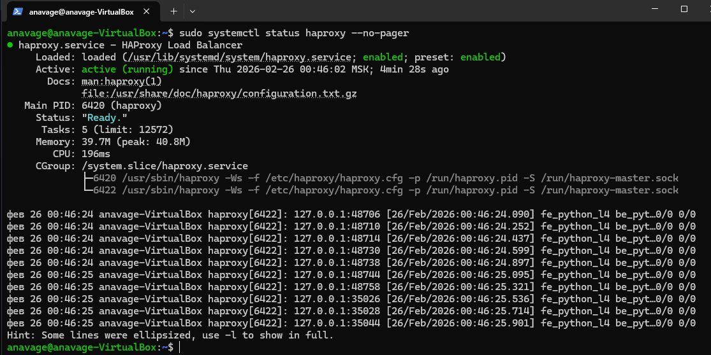
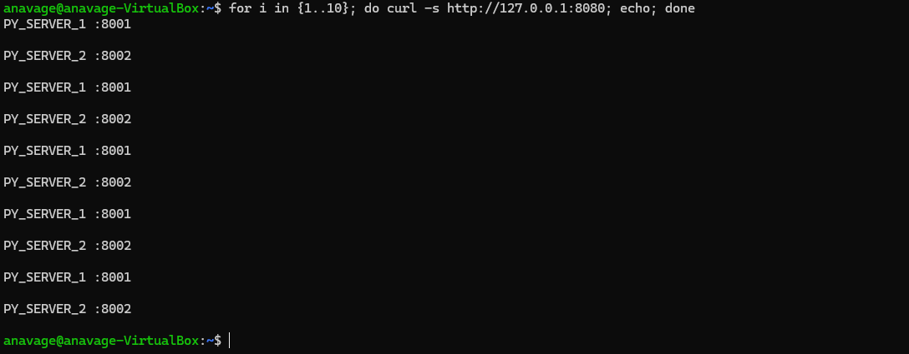
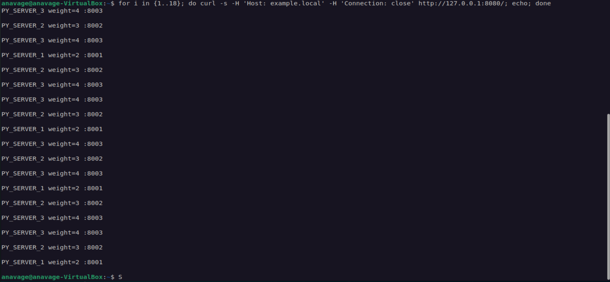
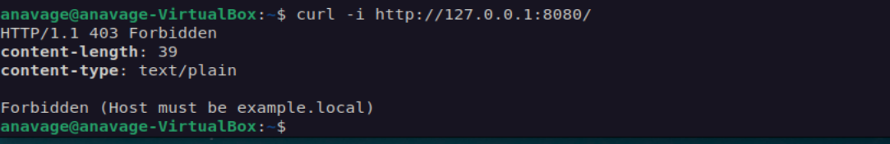

# balabce

**Кolesnikov Aleksandr**  

## Задание 1

### Скриншот работы HAproxy

### Скриншот pyton-servers

### Скриншот балансировки

### Файл конфигурации HAproxy
[Файл конфигурации HAproxy](cfg_files/1_haproxy.cfg)

## Задание 2

### Скриншот с доменом 

### Скриншот без домена

### Файл конфигурации HAproxy
[Файл конфигурации HAproxy](cfg_files/2_haproxy.cfg)
